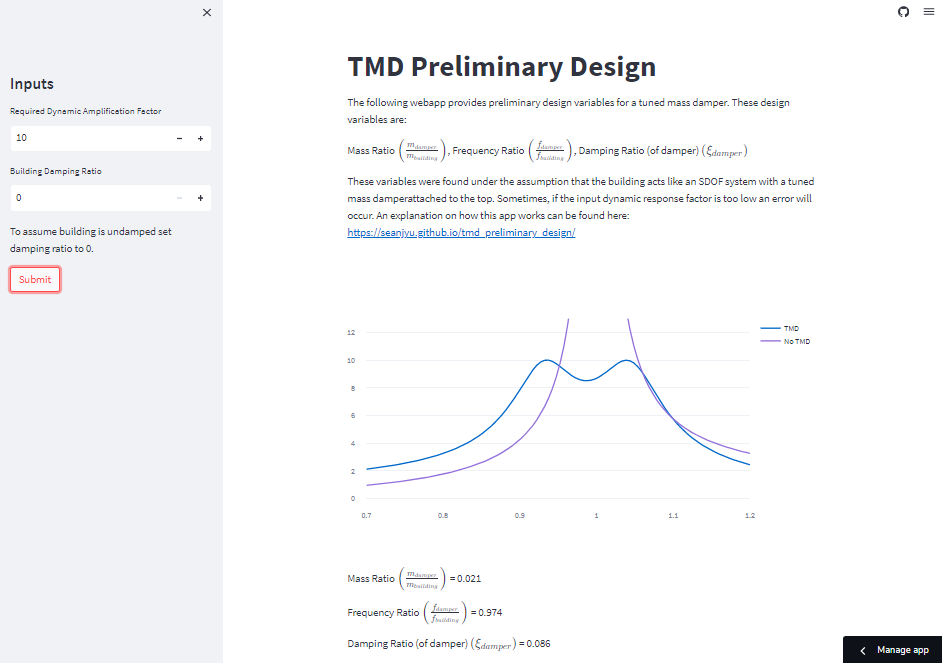

# Tuned Mass Damper Preliminary Design Web App

The following web app gives an approximate design for tuned mass dampers given a dynamic amplification factor (DAF) and building damping ratio. This app is based off the equations found in the textbook Structural Motion Engineering by J Connor and S Laflamme; and the paper “Optimum tuned-mass dampers for minimizing steady-state response of support-excited and damped systems" by H.-C. Tsai and G.-C Lin. 
The optimized design variables are the mass ratio ($\Big(\\frac{m_{damper}}{m_{building}}$), frequency ratio ($\Big(\\frac{f_{damper}}{f_{building}}\Big)$) and the Damping ratio of the damper ($(\\xi_{damper})$). 

A more in depth documentation as to how the design is calculated can be found in my blog:

https://seanjyu.github.io/tmd_preliminary_design/

The app is hosted on streamlit and can be accessed at this website:

https://seanjyu-tmd-prelim-design-tmd-prelim-design-br7ilo.streamlit.app/

## Package Requirements  
To run this app locally the following packages must be installed. 

Streamlit (1.17.0)
Numpy (1.21.6)
Pandas (1.3.5)
Plotly (5.12.0)
Scipy (1.7.3)

## Instructions
To use the app just specify the required DAF and building damping ratio in the left pane and then press submit.
